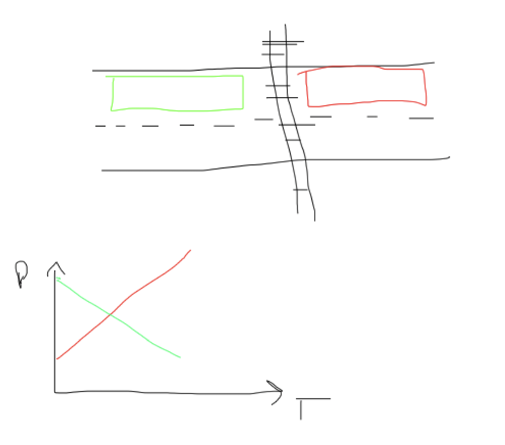

# cities-in-motion-video
Cities in Motion Workshop:  Transportation Data Innovation Challenge IIA Data Analytics Hackathon &amp; Brainstorming Workshop  Co-Sponsored by the University of Illinois Chicago and the University of Toronto

# Slides/Parts
1. Data/Project description: Talk about SAGE sensors
    - describe png image data
    - jsonl sensor data
2. Research direction: what we are doing with the data
    - Analyze density of sensor detections in lanes up and downstream of train tracks
    - use JSONL data to find centroids of bounding boxes
    - get counts of detections within delineated zones
    - plot detections per delineation zone by time stamp
    - check those plots for peculiar
    behavior, most likely queue build-up or over flow

# Traffic Volume spillback/queue growth
Use the data to detect when vehicles accumulate prior to the rail crossing, a sign of a possible danger condition

#TODO

1. Use the `get_detections_df()` function from `utils` to get a DataFrame at the detection level granularity
2. Develop a heuristic using columns (`model`, `class`, `confidence` a potential starting point) to filter our rows we believe are low confidence or errors (Joao)
3. Replace or append the YOLO26 detections to the DataFrame. If confident they can replace image instances (`has_image=True`) replace them, or add to the dataset as neccessary (Keira)
4. Create a new column(s) that returns True or False for each detection if the centorid of the detection is located within one of our boundary zones. Once boundary zones are applied, you can group rows by timestamp and get count for each boundary zone. (Zahra) These counts will need to be normalized but that will come later. (Isaac)
5. Need a final, filtered and transformed dataset following the above steps for final deliverables/visualizations.
6. Need to finalze the 2D area for each location and create a fishnet blocking for plotting/spatial confidence analysis (Zahra and Joao)
7. Generate homographic projection (Image to 2D areial) for each location (Isaac start, Keira apply)

## Final Deliverables for Presentation
- A timestamp/detection plot for each datset showing the change in detections for each boundary zone. We will have to come up with some discussion on what the plots mean.
- A visual demostrating the results of the homographic projection.
- A 2D aerial/gis plot showing showing a scatter of detection locations (could be an animation as well).
- A 2D aerial/gis heat map showing something related to confidence, to show if the models struggle to detect objects in a certain area of the intersection